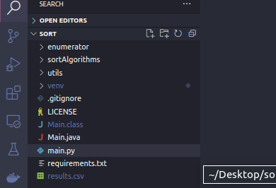

# Ordenation-Algorithms

This project has been created with the purpose of benchmarking the main sorting algorithms.

The benchmark has been conducted using arrays of **100**, **1000**, **100000**, and **500000** integer elements in three different orders: **RANDOM**, **ASCENDING**, and **DESCENDING**, while testing Quick Sort, **Merge Sort**, **Selection Sort**, and **Insertion Sort**.

The benchmark results are saved in a .csv file called **results**.

After saving the results, you can run a Python script to plot graphs for result analysis.

## Stacks
* Java - 17.0.6
* Python - 3.10

## How run the project
* Open the root folder of the project.



* Open a terminal and run the following commands (this step can take a long time):

    ```java
        javac Main.java
        java -Xss80m Main.java
    ```
* Create a virtual enviroment and install the depedencies, commands bellow:
    
    ```python
        python3.10 -m venv venv
        source venv/bin/activate
        pip install -r requirements.txt
    ```
    
* Run the python script:
    ```python
        python3.10 main.py
    ```
    
After that, your results.csv will be filled and you output will be like that: 


After closing one graph, another will appear.


## Obs
In this project, I used Python 3.10, but it may work with earlier versions. The commands may need to be adapted in your case, and you might be able to call Python without specifying the version, using just the "python" command.